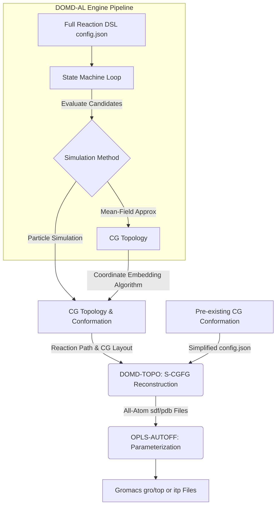

```text
██████╗  ██████╗ ███╗   ███╗██████╗    ████████╗ ██████╗  ██████╗ ██╗     ██╗  ██╗██╗████████╗
██╔══██╗██╔═══██╗████╗ ████║██╔══██╗   ╚══██╔══╝██╔═══██╗██╔═══██╗██║     ██║ ██╔╝██║╚══██╔══╝
██║  ██║██║   ██║██╔████╔██║██║  ██║█████╗██║   ██║   ██║██║   ██║██║     █████╔╝ ██║   ██║   
██║  ██║██║   ██║██║╚██╔╝██║██║  ██║╚════╝██║   ██║   ██║██║   ██║██║     ██╔═██╗ ██║   ██║   
██████╔╝╚██████╔╝██║ ╚═╝ ██║██████╔╝      ██║   ╚██████╔╝╚██████╔╝███████╗██║  ██╗██║   ██║   
╚═════╝  ╚═════╝ ╚═╝     ╚═╝╚═════╝       ╚═╝    ╚═════╝  ╚═════╝ ╚══════╝╚═╝  ╚═╝╚═╝   ╚═╝   
```

# DoMD-Toolkit: System Architecture and Global Workflow

This document serves as the technical manual for the DoMD-Toolkit. This comprehensive suite of computational tools is engineered to bridge the gap between abstract chemical definitions, coarse-grained (CG) reaction simulations, and fully parameterized all-atom (AA) molecular dynamics systems.

The toolkit currently comprises three specialized engines, accessible via the [DoMD-Toolkit WebUI](https://www.domd.today/tools):

* **DOMD-AL:** An all-in-one reaction simulation engine driven by a bespoke Reaction Domain-Specific Language (DSL). It utilizes a mean-field approximation to dynamically generate CG topologies from abstract chemical logic, eventually yielding fully parameterized AA force fields.
* **DOMD-TOPO:** A topological FG engine designed for Coarse-Graining to Fine-Graining (CG-FG) reconstruction. It operates on a vastly simplified DSL, functioning optimally when the CG conformation and configuration are pre-supplied.
* **OPLS-AUTOFF:** An automatic OPLS force-field parameterizer that receives AA geometries and generates ready-to-use simulation topologies.

---

## 1. The Global Workflow and System Architecture

The fundamental design of the DoMD-Toolkit relies on a highly flexible Reaction DSL. In an ideal, end-to-end workflow, the DSL encapsulates both the CG-FG mapping information and the explicit chemical logic (e.g., radical initiation, general step-growth).

This comprehensive data structure drives a continuous state machine loop:
**Evaluate System State $\rightarrow$ Extract Candidates (via spatial sampling) $\rightarrow$ React (constructing CG operators via SMARTS parsing).**

Candidate extraction can be resolved either through **Particle Simulations** (yielding CG topology and conformation simultaneously) or via **Mean-Field Approximations** (yielding CG topology, which requires a subsequent coordinate embedding step). The generalized pathways are illustrated below:


---

## 2. System Definitions and Architectural Primitives

To precisely model reaction kinetics and geometric boundaries, the Reaction DSL relies on a strict set of conceptual primitives.

### 2.1 Core Chemical Entities

| Entity | Definition & Structural Behavior |
| --- | --- |
| **Reactant** | The fundamental chemical unit, defined via a standard `smiles` string (for complete molecules) or a `smarts` string (for fragments). Each reactant must declare a `max_valence` parameter, establishing the theoretical upper bound for permissible reaction edges. |
| **Filler** | A composite construct utilized to introduce macroscopic topological boundaries, such as nanoparticles or crosslinking hubs, into the CG phase. Architecturally, a filler is resolved into an **unreactive central core** conjugated to multiple **reactive arms**. These arms reference the `type` of a standard reactant, inheriting its structural attributes and integrating directly into the system's dynamic node pools. |
| **Reaction** | The topological rule governing inter-entity connectivity. Formulated using RDKit-compatible SMARTS templates (e.g., `[C:1].[N:2]>>[C:1][N:2]`), these rules dictate the precise mechanism of coarse-grained edge addition following a successful stochastic reaction event. |

### 2.2 System State and Graph Dynamics

* **Slot Alignment:** This operates as the universal coordinate system within the DSL. Indices defined via SMARTS atom mapping (e.g., `:1`, `:2`) strictly correlate with the reactant list, candidate nodes, and designated type changes.
* **General vs. Radical Mechanisms:**
* *General reactions* involve stochastic sampling from the aggregate pool of all nodes matching the requisite type.
* *Radical reactions* mandate strict pool segregation: initiating slots are drawn exclusively from an `active` node pool, whereas target slots are sampled from an `inactive` pool.


---

## 3. Engine Specifications and DSL Flexibility

The modularity of the toolkit permits users to enter the pipeline at different stages of their research workflow.

### 3.1 DOMD-AL: The Full Kinetic State Machine

For execution within DOMD-AL, a comprehensive DSL specification is mandatory. The computational engine relies on the complete state machine—encompassing dynamic node pools, strict valence tracking, intrinsic probabilities, and spatial candidate evaluation—to accurately integrate the simulated reaction kinetics over discrete time steps.

### 3.2 DOMD-TOPO: The Simplified Configuration

For systems possessing a predefined CG scheme and a corresponding CG conformation (e.g., configurations exported from an external coarse-grained particle engine), formulating a complex kinetic DSL is computationally redundant.

In this context, the `config.json` is aggressively simplified. DOMD-TOPO operates strictly as a "Chemical Compiler," bypassing dynamic simulation semantics (such as `intrinsic_probability` and active/inactive state tracking) to focus exclusively on atomistic mapping rules and connection SMARTS. If empirical chronological reaction pathways are absent, the engine defaults to a Breadth-First Search (BFS) algorithm to dynamically deduce valid connection pathways and reconstruct the fully atomistic topological graph.

---

## 4. DOMD-AL Example: Full Kinetic Simulation

To elucidate the operational mechanics of DOMD-AL, the following `config.json` snippet models a hybrid system characterized by radical polymerization alongside a nanoparticle filler functioning as a topological crosslinking hub.

### 4.1 Reactants and Fillers Initialization

```json
"reactants": [
  { "name": "I", "smiles": "CC", "N": 5, "max_valence": 1, "activate": 5 },
  { "name": "P", "smiles": "CC", "N": 10, "max_valence": 2 },
  { "name": "R", "smarts": "[N:1]([H:2])[H:3]", "max_valence": 1 }
],
"fillers": [
  {
    "name": "SiO2", "N": 1, "file": "core.pdb",
    "mappings": [
      { "cg_id": 1, "type": "R", "atom_idx": [0, 32, 33] },
      { "cg_id": 2, "type": "R", "atom_idx": [23, 38, 39] }
    ]
  }
]

```

* **System Function:** Initiator molecules (`I`) are instantiated entirely within the `active` node pool to propagate radical reactions. Monomers (`P`) originate in the `inactive` pool.
* **Filler Integration:** The `SiO2` filler maps discrete spatial coordinates (`atom_idx`) to specific CG nodes (`cg_id`). Crucially, these peripheral arms are assigned `"type": "R"`, inheriting the properties of reactant `R` and injecting reactive sites directly onto the rigid nanoparticle surface.


### 4.2 Dynamic Reaction Rules

```json
{
  "name": "IP-radical",
  "kind": "radical",
  "reactants": ["I", "P"],
  "activation": { "from": 0, "to": 1 }
},
{
  "name": "PP-general",
  "reactants": ["P", "P"],
  "type_changes": [ { "node": 0, "to": "P" } ]
}

```

* **Radical Propagation:** The `IP-radical` rule enforces strict pool partitioning. Slot 0 (`I`) is sampled from the active pool, and Slot 1 (`P`) from the inactive pool. Upon topological edge formation, the `"activation"` block transfers the radical state from Slot 0 to Slot 1.
* **Explicit State Logging:** The `PP-general` rule omits the `kind` parameter, defaulting to a general mechanism. Instructing Node 0 to transition to type `"P"` forces the deterministic generation of an explicit `TypeChangeEvent` in the Reaction Path, documenting a coarse-grained coupling event without fabricating superficial chemical types.

---

## 5. DOMD-TOPO Example: Static Topological Reconstruction

The following configuration delineates the operational modality of DOMD-TOPO when decoupled from dynamic simulations. Deployed when a user provides a pre-equilibrated coarse-grained configuration lacking explicit reaction history, it utilizes a BFS fallback algorithm to achieve deterministic AA reconstruction.

### 5.1 Simplified Reactants and Rigid Anchoring

```json
"cg_topology_file": "out_au_peo_au_large.xml",
"reactants": [
    { "name": "PEO", "smiles": "OCCO" },
    { "name": "Au_G", "smarts": "[Au]" }
],
"fillers": [
    {
        "name": "Au", "file": "au.pdb",
        "mappings": [
            { "cg_id": 0, "atom_idx": [0], "type": "Au_G" }
        ],
        "filler_idx": [0]
    }
]

```

* **Kinetic Erasure:** The DSL discards dynamic state parameters (`activate`, `max_valence`, discrete `N` limits). The objective is strictly to map chemical identities to the external topology file (`out_au_peo_au_large.xml`).
* **Explicit Anchoring:** Spatial CG nodes are mapped to precise atom indices on the input `au.pdb` structure, designated with `"type": "Au_G"`. This instructs the S-CGFG engine to treat these physical coordinates as valid structural anchoring points for the polymer matrix during the subsequent embedding phase.


### 5.2 Static Templates and BFS Fallback

```json
"reactions": [
    {
        "name": "a",
        "reactants": [["PEO", "PEO"]],
        "smarts": "[C:1][O:2].[O:3][C:4]>>[C:1][O:2][C:4].[O:3]",
        "prod_idx": [0]
    }
]

```

* **Topological Assembly:** The reactions block functions solely as a structural template library. The `prod_idx: [0]` parameter instructs the compiler to evaluate the primary RDKit product molecule to register the cross-slot bonds.
* **Algorithmic Resolution:** Due to the absence of a chronological reaction trajectory in the input XML, DOMD-TOPO implements an implicit BFS sorting algorithm. The engine queries the static templates to infer default connection pathways systematically, resolving the macroscopic crosslinked network while enforcing state verification to prevent valency violations during Cartesian coordinate generation.


