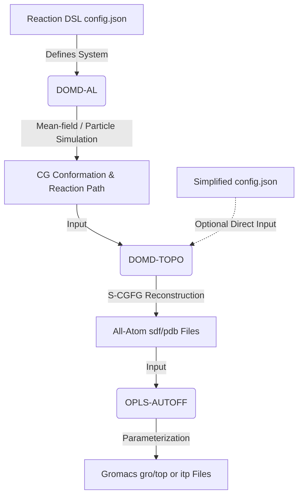
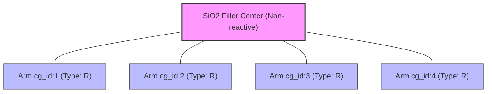
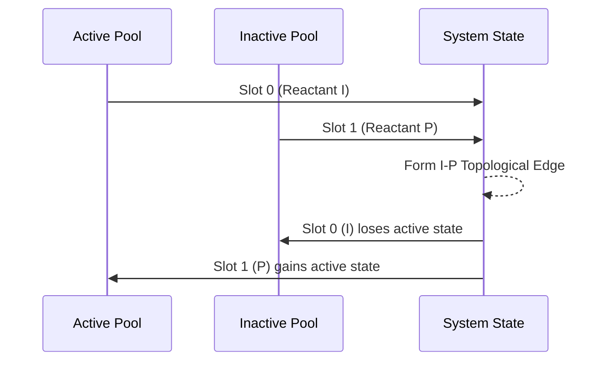

```text
 ██████████            ██████   ██████ ██████████  
░░███░░░░███          ░░██████ ██████ ░░███░░░░███ 
 ░███   ░░███  ██████  ░███░█████░███  ░███   ░░███
 ░███    ░███ ███░░███ ░███░░███ ░███  ░███    ░███
 ░███    ░███░███ ░███ ░███ ░░░  ░███  ░███    ░███
 ░███    ███ ░███ ░███ ░███      ░███  ░███    ███ 
 ██████████  ░░██████  █████     █████ ██████████  
░░░░░░░░░░    ░░░░░░  ░░░░░     ░░░░░ ░░░░░░░░░░   
```

# DoMD-Toolkit: System Architecture and Global Workflow

This document serves as the technical manual for the DoMD-Toolkit. This comprehensive suite of computational tools is engineered to bridge the gap between abstract chemical definitions, coarse-grained (CG) reaction simulations, and fully parameterized all-atom (AA) molecular dynamics systems.

The toolkit currently comprises three specialized engines, accessible via the [DoMD-Toolkit WebUI](https://www.domd.today/tools):

1. **DOMD-AL:** An all-in-one reaction simulation engine driven by a bespoke Reaction DSL.
2. **DOMD-TOPO:** A topological "Chemical Compilation" engine for Coarse-Graining to Fine-Graining (CG-FG) reconstruction.
3. **OPLS-AUTOFF:** An automatic OPLS force-field parameterizer generating ready-to-use simulation topologies.
To effectively utilize the toolkit, a rigorous understanding of module interactions and the conceptual primitives defining the chemical system is required.

---

## 1. The Global Workflow

The architectural framework of the DoMD-Toolkit operates on a sequential pipeline: **Definition $\rightarrow$ Reaction $\rightarrow$ Fine-Graining $\rightarrow$ Parameterization**.



### 1.1 The Step-by-Step Pipeline

* **Step 1: System Definition (Reaction DSL).** The protocol initiates with a `config.json` file formulated in the Reaction DSL. This configuration establishes the CG scheme, defining fundamental reactants, filler materials, and the governing topological reaction rules.
* **Step 2: Reaction Simulation (DOMD-AL).** Driven by the DSL, DOMD-AL executes CG-scale simulations utilizing either mean-field approximations or particle-based engines. It evaluates spatial candidates, applies stochastic reaction probabilities, and produces a dynamic chronological sequence of structural transformations. The ultimate output comprises an equilibrated CG conformation alongside a detailed reaction trajectory.
* **Step 3: Fine-Graining (DOMD-TOPO).** The resulting CG conformation is transferred to DOMD-TOPO. This engine employs a SMILES/SMARTS-driven framework (S-CGFG) to deterministically backmap the coarse-grained topology into a fully coordinate-embedded AA structure.
* **Step 4: Force-Field Assignment (OPLS-AUTOFF).** Finally, the AA structure is processed by OPLS-AUTOFF. This module assigns OPLS force-field parameters—augmented by BOSS database heuristics and machine learning inference—to output standard GROMACS `.gro` and `.top`/`.itp` files.

---

## 2. System Definitions & Architectural Primitives

To precisely model reaction kinetics and topology, the Reaction DSL relies on a strict set of conceptual primitives.

### 2.1 Core Entities

| Entity | Definition & Structural Behavior |
| --- | --- |
| **Reactant** | The fundamental chemical unit. It is defined via a standard `smiles` string (for complete molecules) or a `smarts` string (for molecular fragments). Each reactant must specify a `max_valence` parameter to establish the theoretical upper bound of permissible reaction edges. |
| **Filler** | A specialized composite construct utilized to model complex topological entities (e.g., nanoparticles, crosslinkers). Architecturally, a filler is resolved into an **unreactive central core** conjugated to multiple **reactive arms**. These arms reference a specific `type` of a standard reactant, thereby inheriting its structural attributes and integrating into its corresponding dynamic node pools. |
| **Reaction** | The topological rule governing inter-entity connectivity. Reactions are formulated using RDKit-compatible SMARTS templates (e.g., `[C:1].[N:2]>>[C:1][N:2]`), which dictate the precise mechanism of edge addition to the CG graph following a successful chemical event. |

### 2.2 System State & Graph Dynamics

* **Slot Alignment:** This serves as the universal coordinate system within the DSL. Indices defined via SMARTS atom mapping (e.g., `:1`, `:2`) strictly correlate with the reactant list, candidate nodes, and designated type changes.
* **Valence Constraints:** The `max_valence` parameter operates as a strict upper limit for reaction-induced edges. Pre-existing structural bonds, such as those linking a filler core to its respective arms, do not deplete this reactive valence capacity.
* **General vs. Radical Mechanisms:**
* *General reactions* involve stochastic sampling from the aggregate pool of nodes matching the requisite type.
* *Radical reactions* mandate strict pool segregation: initiating slots are exclusively drawn from an `active` node pool, whereas target slots are selected from an `inactive` pool.
* **Type Changes:** Reactions may be deterministically coupled with `type_changes`. Upon the acceptance and logging of a primary reaction within the reaction path, any associated type transitions (e.g., Node B converting to Node C) are executed sequentially as subsequent pseudo-time events.


---

## 3. Tool Synergy & DSL Flexibility

The DoMD-Toolkit is engineered for modularity, accommodating users who require complete kinetic simulations as well as those who possess pre-equilibrated structural data.

### 3.1 DOMD-AL: The Full State Machine

For execution within DOMD-AL, a comprehensive DSL specification is mandatory. The computational engine relies on a complete state machine—encompassing dynamic node pools, strict valence tracking, intrinsic probabilities, and customizable spatial algorithms (`candidate_fn` and `prob_fn`)—to accurately integrate the simulated reaction kinetics over discrete time steps.

### 3.2 DOMD-TOPO: The Simplified Configuration

For systems with a predefined CG scheme and a corresponding CG conformation (e.g., derived from external molecular dynamics engines), formulating a complex DSL outlining reaction kinetics is unnecessary.

In the context of **DOMD-TOPO**, the `config.json` is significantly condensed, requiring only:

* A `reactants_config` dictionary mapping active CG bead types to their constituent AA SMILES representations.


* A simplified `reaction_template` detailing the topological SMARTS templates that govern spatial bead connectivity.


Functioning strictly as a "Chemical Compiler," DOMD-TOPO bypasses dynamic simulation semantics (such as reaction probabilities and active/inactive state tracking). In instances where empirical chronological reaction order pathways are omitted, DOMD-TOPO defaults to a Breadth-First Search (BFS) algorithm to deduce fundamental connection pathways and reconstruct the fully atomistic topological graph.

---

## 4. DOMD-AL Example: Deconstructing the Reaction DSL

To elucidate the operational mechanics of DOMD-AL during a reaction simulation, the provided `config.json` is analyzed below. This configuration models a hybrid system characterized by radical polymerization (incorporating initiators and monomers) alongside a nanoparticle filler functioning as a topological crosslinking hub. The complete example (`config.json` coupled with `core.pdb`) is provided in `Examples/domd_al_example.zip`.

### 4.1 Reactants: The Foundational Entities

The `reactants` array defines the fundamental chemical species and their initialization parameters.

| Name | Type | Properties | System Function |
| --- | --- | --- | --- |
| **I** | `CC` | `N=5`, `max_valence=1`, `activate=5` | **Initiator:** Five independent molecules are instantiated and immediately allocated to the `active` node pool to propagate radical reactions. The valence capacity is restricted to 1, structurally limiting it to a single bond formation. |
| **P** | `CC` | `N=10`, `max_valence=2` | **Polymer/Monomer:** Ten independent molecules are generated. With a default `activate` value of 0, these entities originate in the `inactive` pool. A `max_valence` of 2 permits continuous linear chain propagation. |
| **R** | `[N:1]([H:2])[H:3]` | `N=2`, `max_valence=2`, `activate=4` | **Reactive Linker:** Two discrete molecules are instantiated. The specification dictates 4 `active` nodes; this is mathematically permissible because `R` also functions as a filler arm (detailed in Section 4.2), meaning the aggregate pool of `R` nodes is sufficiently large to accommodate the 4 mandated active states. |
| **Q** | `[NH3]` | `max_valence=3` | **Fragment:** Defined strictly via a `smarts` string, precluding independent geometric existence (the `N` parameter is inherently disallowed). It operates as a structural template constrained to a maximum of 3 topological connections. |

### 4.2 Fillers: Topological Hubs

The `fillers` section introduces spatial constraints and complex geometric boundaries into the CG graph.

```json
"fillers": [
  {
    "name": "SiO2",
    "N": 2,
    "file": "core.pdb",
    "mappings": [...]
  }
]

```

This configuration defines two instances of a silica (`SiO2`) nanoparticle.

* **Structural Parsing:** Each filler is computationally partitioned into a non-reactive central core and multiple reactive exterior arms.
* **Mapping Coordinates:** The `mappings` array explicitly assigns 4 peripheral arms (`cg_id` 1 through 4) to this filler.
* **Type Inheritance:** Crucially, each arm is assigned the structural identifier `"type": "R"`. Consequently, these filler arms inherit the defined structural properties of `R` (`max_valence=2`) and are integrated directly into the global dynamic node pools for reactant `R`.




Note: Given the presence of two `SiO2` fillers, 8 `R` arms are introduced into the system. Combined with the 2 standalone `R` nodes, the aggregate pool comprises 10 `R` nodes. The `activate: 4` directive in the reactant definition will subsequently apply the active state to 4 randomly selected nodes from this expanded pool of 10.

### 4.3 Reactions: Governing the State Machine

The `reactions` array establishes the precise topological rules and state transitions governing the simulation.

#### A. Radical Mechanisms (Initiation & Propagation)

```json
{
  "name": "IP-radical",
  "kind": "radical",
  "reactants": ["I", "P"],
  "activation": { "from": 0, "to": 1 }
}

```

* **Mechanism Execution:** The `kind: "radical"` designation compels DOMD-AL to enforce strict pool partitioning. Slot 0 (`I`) is exclusively sampled from the `active` pool, while Slot 1 (`P`) is sampled from the `inactive` pool.
* **Active State Transfer:** The `"activation"` block operates as the state transition engine. Following a successful reaction, the active (radical) state is geometrically transferred `from` Slot 0 (`I`) `to` Slot 1 (`P`).
* **Chain Propagation (`PP-radical`):** Analogously, the `PP-radical` rule facilitates the reaction between an active `P` and an inactive `P`, continuously propagating the reactive state along the expanding polymer chain.



#### B. General Mechanisms & Explicit State Logging

```json
{
  "name": "PP-general",
  "reactants": ["P", "P"],
  "type_changes": [ { "node": 0, "to": "P" } ]
}

```

* **Mechanism Execution:** The omission of the `kind` parameter defaults the reaction to `"general"`. The computational engine subsequently samples from the entire pool of `P` nodes, disregarding their active or inactive status.
* **Type Change (The Isomorphic Transition):** Node 0 (type `P`) is mathematically instructed to transition `to` type `"P"`. This deliberate redundancy within the DSL forces the deterministic generation of a `TypeChangeEvent(from=P, to=P)`. This design pattern enables the explicit recording of a coarse-grained coupling event within the Reaction Path history without necessitating the formulation of a superficial chemical type within the state machine.

```json
{
  "name": "R-P",
  "reactants": ["R", "P"],
  "smarts": "[N:1][H:3].[CH3:2]>>[N:1][C:2].[H:3]",
  "prod_idx": [0],
  "type_changes": [ { "node": 1, "to": "P" } ]
}

```

* **Filler Crosslinking:** This rule dictates the topological linkage between the reactive `R` species (predominantly functioning as `SiO2` filler arms) and the `P` polymer matrix.

## 5. DOMD-TOPO Example: Static Topological Reconstruction

To delineate the operational modality of DOMD-TOPO when decoupled from dynamic simulations, the following `config.json` (in `Examples/au_peg_au.zip`) illustrates a pure topological reconstruction. This configuration is deployed when a user provides a pre-equilibrated coarse-grained configuration (e.g., derived from external particle engines) but lacks the explicit chronological reaction history. Under these conditions, DOMD-TOPO functions strictly as a "Chemical Compilation" engine, utilizing a Breadth-First Search (BFS) algorithm to infer connection pathways and reconstruct the all-atom (AA) graph.

### 5.1 System Initialization and Reactants

In this static compilation mode, the DSL discards dynamic state parameters (such as `activate`, `max_valence`, or discrete node generation limits `N`). The objective is solely to establish the chemical identity of the CG beads mapping to the provided coordinate file.

```json
"cg_topology_file": "out_au_peo_au_large.xml",
"reactants": [
    {
        "name": "PEO",
        "smiles": "OCCO"
    },
    {
        "name": "Au_G",
        "smarts": "[Au]"
    }
]

```

* **Topological Input:** The `cg_topology_file` explicitly references an external data structure (`out_au_peo_au_large.xml`) containing the requisite 3D spatial coordinate vectors and structural rigid-body grouping indices for the CG system.
* **Chemical Descriptors:** The `reactants` array defines the baseline molecular identities. The polyethylene oxide (`PEO`) matrix is defined via its standard SMILES string, while the reactive gold surface grafting sites (`Au_G`) are defined via an elemental SMARTS descriptor.

### 5.2 Filler Constraints and Structural Mapping

The `fillers` section introduces the rigid geometry of gold nanoparticles (`Au`) into the topological reconstruction.

```json
"fillers": [
    {
        "name": "Au",
        "file": "au.pdb",
        "mappings": [
            { "cg_id": 0, "atom_idx": [0], "type": "Au_G" },
            { "cg_id": 18, "atom_idx": [18], "type": "Au_G" }
            // ... additional mappings ...
        ],
        "filler_idx": [0]
    }
]

```

* **Explicit Anchoring:** Unlike the dynamic DOMD-AL workflow where arms react randomly, this configuration strictly maps predefined CG spatial nodes (`cg_id`) to exact atom indices (`atom_idx`) on the input `au.pdb` structure.
* **Type Designation:** Selected atoms on the gold nanoparticle surface are explicitly designated with `"type": "Au_G"`. This instructs the S-CGFG engine to treat these specific coordinates as valid structural anchoring points for the polymer matrix during the subsequent embedding phase.

### 5.3 Static Reaction Templates and BFS Fallback

The `reactions` block in this configuration is stripped of kinetic semantics (e.g., `intrinsic_probability`, `kind`, `activation`). It functions solely as a structural template library to direct localized topological assembly.

```json
"reactions": [
    {
        "name": "a",
        "reactants": [["PEO", "PEO"]],
        "smarts": "[C:1][O:2].[O:3][C:4]>>[C:1][O:2][C:4].[O:3]",
        "prod_idx": [0]
    },
    {
        "name": "b",
        "reactants": [["Au_G", "PEO"]],
        "smarts": "[Au:1].[O:2][C:3]>>[Au:1][O:2][C:3]",
        "prod_idx": [0]
    }
]

```

* **Template Mechanisms:**
* Template `a` dictates the dehydration condensation linkage between two `PEO` monomers, relying on explicit map identifiers to define the reactive centers.
* Template `b` delineates the grafting coordination between a gold surface site (`Au_G`) and a `PEO` oxygen atom.
* **The Breadth-First Search (BFS) Solver:** Because the input XML file provides the final graph connectivity but lacks the chronological historical order of bond formation, the topological compiler must determine a mathematically valid sequence to iteratively construct the AA configuration.
* **Algorithmic Resolution:** The engine implements an implicit BFS sorting algorithm to systematically infer default connection pathways across the macroscopic crosslinked network. The BFS systematically queries the static templates (`a` and `b`) to stitch the corresponding monomer subgraphs. Concurrently, it maintains a unified Reacted Atom Set to enforce state verification, ensuring that valency boundaries are not violated during the deterministic backmapping of abstract graph connections into physical Cartesian coordinates.
* **SMARTS Execution & Product Indexing:** The SMARTS string explicitly delineates a hydrogen atom (`[H:3]`) dissociating from the nitrogen to facilitate the target `N-C` bond formation. The `prod_idx: [0]` parameter instructs the compilation engine to strictly evaluate the primary product molecule generated by the RDKit backend when registering the resultant coarse-grained edges.
