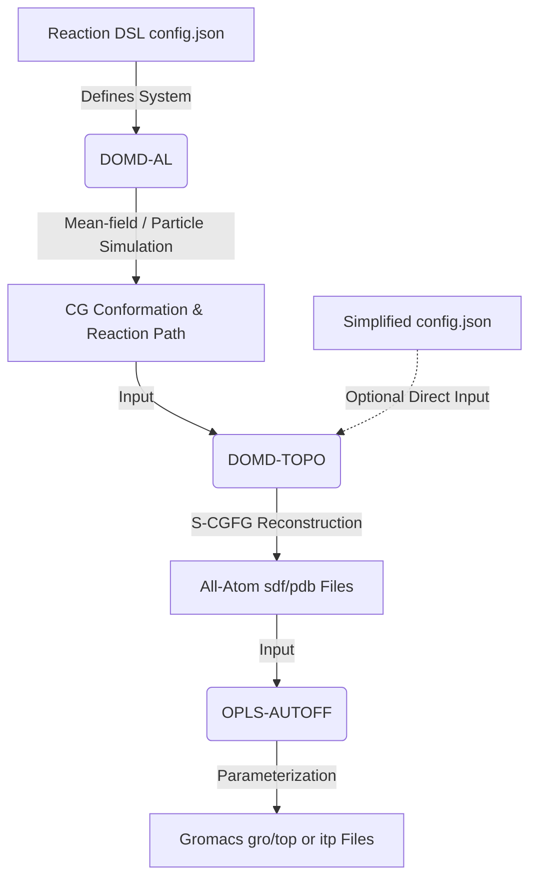
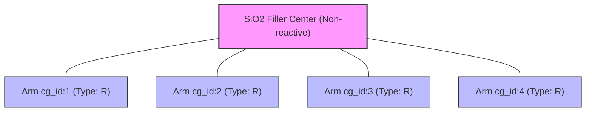
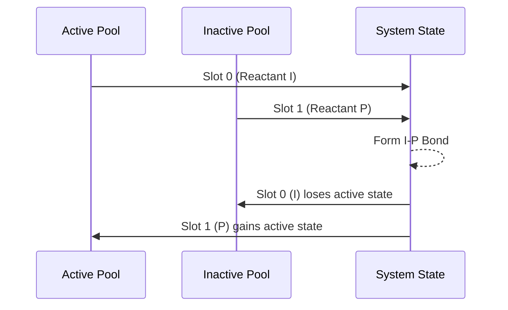

```text
 ██████████            ██████   ██████ ██████████  
░░███░░░░███          ░░██████ ██████ ░░███░░░░███ 
 ░███   ░░███  ██████  ░███░█████░███  ░███   ░░███
 ░███    ░███ ███░░███ ░███░░███ ░███  ░███    ░███
 ░███    ░███░███ ░███ ░███ ░░░  ░███  ░███    ░███
 ░███    ███ ░███ ░███ ░███      ░███  ░███    ███ 
 ██████████  ░░██████  █████     █████ ██████████  
░░░░░░░░░░    ░░░░░░  ░░░░░     ░░░░░ ░░░░░░░░░░   
```

# DoMD-Toolkit: System Architecture and Global Workflow

Welcome to the DoMD-Toolkit manual. This comprehensive suite of tools is designed to bridge the gap between abstract chemical definitions, Coarse-Grained (CG) reaction simulations, and fully parameterized All-Atom (AA) molecular dynamics systems.

The toolkit currently comprises three specialized engines, accessible via the [DoMD-Toolkit WebUI](https://www.domd.today/tools):

1. **DOMD-AL:** An all-in-one reaction simulation engine driven by a bespoke Reaction DSL.
2. **DOMD-TOPO:** A topological "Chemical Compilation" engine for Coarse-Graining to Fine-Graining (CG-FG) reconstruction.
3. **OPLS-AUTOFF:** An automatic OPLS force-field parameterizer generating ready-to-use simulation topologies.

To fully leverage the toolkit, it is essential to understand how these modules interact and the primitive concepts that define a chemical system within our framework.

---

## 1. The Global Workflow

The design philosophy of the DoMD-Toolkit follows a logical pipeline: **Define $\rightarrow$ React $\rightarrow$ Fine-Grain $\rightarrow$ Parameterize**.



### 1.1 The Step-by-Step Pipeline

* **Step 1: System Definition (Reaction DSL).** The journey begins with a `config.json` file written in our Reaction DSL. This file declares the CG scheme, defining the foundational reactants, filler materials, and the structural reaction rules that govern them.
* **Step 2: Reaction Simulation (DOMD-AL).** Using the DSL, DOMD-AL performs simulations (via mean-field approximations or particle engines) at the CG scale. It evaluates spatial candidates, applies reaction probabilities, and generates a dynamic sequence of structural changes. The output is an equilibrated CG conformation and a detailed reaction path.
* **Step 3: Fine-Graining (DOMD-TOPO).** The CG conformation is passed to DOMD-TOPO. This engine utilizes a SMILES/SMARTS-driven framework (S-CGFG) to backmap the coarse-grained layout into a fully coordinate-embedded All-Atom (AA) structure.
* **Step 4: Force-Field Assignment (OPLS-AUTOFF).** Finally, the AA structure is fed into OPLS-AUTOFF. This tool parameterizes the molecules utilizing the OPLS force field (with support for BOSS databases and Machine Learning fallbacks) and outputs standard Gromacs `.gro` and `.top`/`.itp` files.

---

## 2. System Definitions & Architectural Primitives

To model reactions effectively, the Reaction DSL relies on a strict set of conceptual primitives. These keywords define the physics and topology of your system.

### 2.1 Core Entities

| Entity | Definition & Behavior |
| --- | --- |
| **Reactant** | The fundamental chemical unit. It is defined by either a standard `smiles` string (for complete molecules) or a `smarts` string (for molecular fragments). Each reactant specifies a `max_valence` to cap the number of reaction edges it can form. |
| **Filler** | A specialized composite structure used to model complex topological entities (like nanoparticles or crosslinkers). A filler is architecturally resolved into an **unreactive center** bound to multiple **reactive arms**. The arms reference the `type` of a standard reactant, thereby inheriting its structural properties and entering its dynamic node pools for reactions. |
| **Reaction** | The structural rule bridging entities. Reactions are defined by RDKit-compatible SMARTS templates (e.g., `[C:1].[N:2]>>[C:1][N:2]`). They dictate how edges are added to the CG graph upon a successful chemical event. |

### 2.2 System State & Graph Dynamics

* **Slot Alignment:** This is the universal coordinate system of the DSL. The indices defined in your SMARTS atom maps (e.g., `:1`, `:2`) strictly align with the reactant list, candidate nodes, and type changes.
* **Valence:** The parameter `max_valence` acts as the strict capacity limit for reaction edges. Structural bonds (like those connecting a filler center to its arm) do not consume this reaction valence.
* **General vs. Radical Mechanisms:**
* *General reactions* draw randomly from the full pool of nodes matching the required type.
* *Radical reactions* enforce strict pool separation: initiating slots must be drawn from an `active` node pool, while targets are drawn from an `inactive` pool.
* **Type Changes:** Reactions can be deterministically coupled with `type_changes`. Once a main reaction is accepted and logged in the reaction path, any associated type changes (e.g., Node B transitioning to Node C) are executed sequentially as pseudo-time events.
---

## 3. Tool Synergy & DSL Flexibility

While the Reaction DSL is robust enough to drive complex dynamic simulations in **DOMD-AL**, we designed the toolkit to be highly flexible for users who already possess structural data.

### 3.1 DOMD-AL: The Full State Machine

When running DOMD-AL, the entire DSL specification is mandatory. The engine relies on the full state machine—including node pools, valence tracking, intrinsic probabilities, and custom spatial algorithms (`candidate_fn` and `prob_fn`)—to step through the simulated reaction time correctly.

### 3.2 DOMD-TOPO: The Simplified Configuration

If you already possess a well-defined CG scheme and the corresponding CG conformation (e.g., from an external simulation), you **do not** need to write a complex DSL file mapping out reaction kinetics.

For **DOMD-TOPO**, the `config.json` is vastly simplified. You only need to provide:

* A `reactants_config` dictionary mapping the active CG bead types to their underlying All-Atom SMILES strings.
* A simplified `reaction_template` containing the topological SMARTS templates that define how these beads connect.

Because DOMD-TOPO acts purely as a "Chemical Compiler," it discards the dynamic simulation semantics (like probabilities and active/inactive states). If historical reaction order pathways are missing from your input, DOMD-TOPO will simply utilize a Breadth-First Search (BFS) algorithm to infer the default connection pathways and rebuild the All-Atom graph.

Here is a detailed breakdown of the `config.json` example to illustrate how DOMD-AL orchestrates a complex simulation.

---

## 4. DOMD-AL Example: Deconstructing the Reaction DSL

To understand how DOMD-AL executes a reaction simulation, let's dissect the provided `config.json`. This configuration defines a hybrid system featuring radical polymerization (involving initiators and monomers) alongside a nanoparticle filler that acts as a crosslinking hub. The whole example (`config.json` with `core.pdb`) is offered as `Examples/domd_al_example.zip`.

### 4.1 Reactants: The Building Blocks

The `reactants` array defines the fundamental chemical species and their initial states.

| Name | Type | Properties | Role in System |
| --- | --- | --- | --- |
| **I** | `CC` | `N=5`, `max_valence=1`, `activate=5` | **Initiator:** There are 5 independent molecules generated. All 5 are immediately placed into the `active` node pool to kick off radical reactions. Its valence cap is 1, meaning it can only form one bond. |
| **P** | `CC` | `N=10`, `max_valence=2` | **Polymer/Monomer:** 10 independent molecules. By default, `activate` is 0, so these begin in the `inactive` pool. A `max_valence` of 2 allows it to chain together (forming linear backbones). |
| **R** | `[N:1]([H:2])[H:3]` | `N=2`, `max_valence=2`, `activate=4` | **Reactive Linker:** 2 standalone molecules are generated. However, it requires 4 `active` nodes. This is legally permitted because `R` is also utilized as a filler arm (see below), meaning the total pool of `R` nodes is large enough to supply 4 active states. |
| **Q** | `[NH3]` | `max_valence=3` | **Fragment:** Defined via `smarts`, meaning it cannot exist independently (no `N` parameter is allowed). It acts as a structural template, capping at 3 topological connections. |

### 4.2 Fillers: Complex Topological Hubs

The `fillers` section introduces spatial constraints and complex geometries into the CG graph.

```json
"fillers": [
  {
    "name": "SiO2",
    "N": 2,
    "file": "core.pdb",
    "mappings": [...]
  }
]

```

Here, we define 2 instances of a Silica (`SiO2`) nanoparticle.

* **The Anatomy:** Each filler is parsed into a strictly non-reactive central core and several reactive arms.
* **The Mappings:** The `mappings` array explicitly dictates that this filler has 4 arms (`cg_id` 1 through 4).
* **Type Inheritance:** Crucially, each arm is assigned `"type": "R"`. This means these filler arms inherit the structural properties (`max_valence=2`) and are injected directly into the global node pools for reactant `R`.



Because we have two `SiO2` fillers, 8 `R` arms are added to the system, combining with the 2 standalone `R` nodes for a total pool of 10 `R` nodes. The `activate: 4` command in the reactant section will randomly ignite 4 of these 10 nodes.

### 4.3 Reactions: Governing the State Machine

The `reactions` array defines the topological rules and state transitions for the simulation.

#### A. Radical Mechanisms (Initiation & Propagation)

```json
{
  "name": "IP-radical",
  "kind": "radical",
  "reactants": ["I", "P"],
  "activation": { "from": 0, "to": 1 }
}

```

* **Mechanism:** Because `kind` is `"radical"`, DOMD-AL enforces strict pool selection. Slot 0 (`I`) must be drawn from the `active` pool, and Slot 1 (`P`) is drawn from the `inactive` pool.
* **Active Transfer:** The `"activation"` block acts as a state engine. Upon successful reaction, the active (radical) state transfers `from` Slot 0 (`I`) `to` Slot 1 (`P`).
* **Propagation (`PP-radical`):** Similarly, the `PP-radical` rule allows an active `P` to react with an inactive `P`, propagating the active state down the polymer chain.



#### B. General Mechanisms (Crosslinking & Explicit Logging)

```json
{
  "name": "PP-general",
  "reactants": ["P", "P"],
  "type_changes": [ { "node": 0, "to": "P" } ]
}

```

* **Mechanism:** Omitting `kind` defaults to a `"general"` reaction. The engine simply draws from the complete pool of `P` nodes, regardless of their active/inactive status.
* **Type Change (The `B -> B` Trick):** Notice that node 0 (type `P`) is instructed to change `to` type `"P"`. While this seems redundant, the DSL explicitly supports this to force the generation of a `TypeChangeEvent(from=P, to=P)`. This is a clever design pattern: it safely logs a coarse-grained coupling step explicitly in the Reaction Path history without actually having to invent a brand-new chemical type for the state machine.

```json
{
  "name": "R-P",
  "reactants": ["R", "P"],
  "smarts": "[N:1][H:3].[CH3:2]>>[N:1][C:2].[H:3]",
  "prod_idx": [0],
  "type_changes": [ { "node": 1, "to": "P" } ]
}

```

* **Crosslinking the Filler:** This rule links the reactive `R` species (which, remember, are mostly acting as arms on the `SiO2` filler) to the `P` polymer matrix.
* **SMARTS & Product Index:** The SMARTS explicitly shows a Hydrogen (`[H:3]`) leaving the Nitrogen to form the `N-C` bond. The `prod_idx: [0]` tells the compiler to look exclusively at the first generated product molecule in the RDKit backend to map the new coarse-grained edges.
