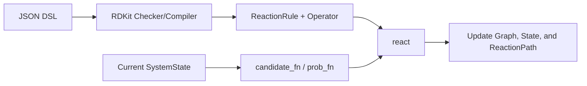
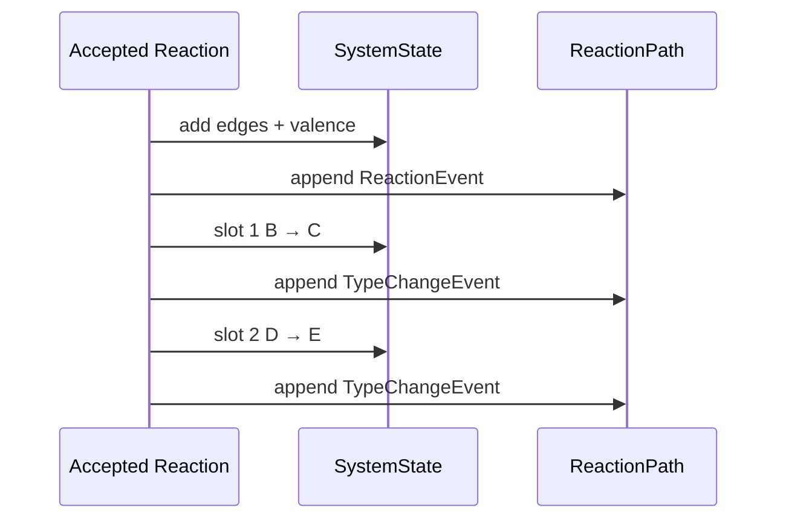
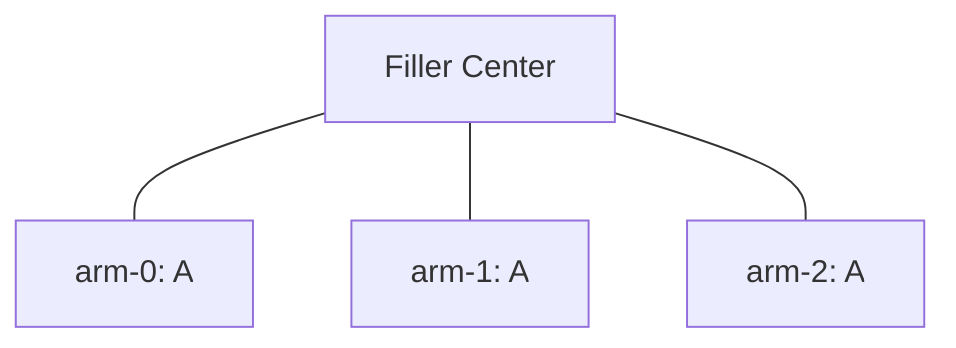

# DoMD Reaction DSL v1: Design Philosophy and Reaction Semantics

## 1. Scope of the DSL

The DoMD Reaction DSL is a minimalist coarse-grained graph reaction language. It is designed to address strictly four programmatic questions:

1.  What coarse-grained nodes and filler arms are present in the initial system?
2.  Which node types are permitted to co-participate in a given reaction rule?
3.  Upon reaction acceptance, how are edges or hyperedges appended to the coarse-grained graph?
4.  Is the reaction coupled with an active state transfer or a type change?

Spatial proximity, field theory, potential energy, diffusion, and kinetic models fall outside the purview of this DSL. Such physical parameters are introduced into the simulator exclusively via the `candidate_fn` and `prob_fn` interfaces.



## 2. Five Core Design Principles

### 2.1 The Slot as the Universal Coordinate

Within a given rule, the following structural positions must be strictly aligned:

```text
reactants[i]
The i-th template on the left side of the SMARTS
Candidate.nodes[i]
operator.degree_delta[i]
type_changes[*].node
activation.from / activation.to

```

For instance, the declaration:

```json
"reactants": ["A", "B"]

```

Dictates that within the candidate `(17, 42)`:

* Slot 0 corresponds to node 17, which strictly must be of type `A`.
* Slot 1 corresponds to node 42, which strictly must be of type `B`.

### 2.2 SMARTS Determines Only Coarse-Grained Edges

For binary and higher-order reactions, reaction SMARTS are parsed by RDKit. The compiler evaluates exclusively the primary product, utilizing atom mapping to identify cross-slot bonds and consequently generate the coarse-grained `ReactionOperator.edges`.

The SMARTS string does **not** infer:

* Active state transfers.
* Coarse-grained type changes.
* Spatial probabilities of candidates.
* Reaction rates.

### 2.3 `max_valence` as the Unified Reaction Edge Capacity

A node's `valence` solely quantifies the coarse-grained edges appended by the reaction operator. Structural bonds connecting a filler center to its arms do not consume this reaction valence.

The necessary condition for a slot's availability is:

```text
current_valence + operator.degree_delta[slot] <= current_max_valence

```

### 2.4 General vs. Radical Mechanisms Are Rule-Defined

* If `kind` is omitted or declared as `"general"`: All slots are sampled based on type, without filtering by active status.
* If `kind` is `"radical"`: The slot designated by `activation.from` is sampled from the active pool; all other slots are sampled from the inactive pool.

The `activate` attribute within a Reactant merely specifies the initial quantity of active nodes randomly selected from the complete node pool of that type. It does not dictate whether a rule is general or radical. A single type may simultaneously participate in both rule categories.

### 2.5 Type Change as a Deterministic Coupled Event

The `type_changes` array does not generate new candidates, recalculate weights, or undergo secondary intrinsic probability evaluations. Upon the acceptance of a primary reaction:

1. The primary reaction operator is executed.
2. The primary `ReactionEvent` is logged within the `ReactionPath`.
3. One or multiple `TypeChangeEvent`s are executed and logged sequentially according to the JSON array order.

Functionally, this operates as an atomic commit within the state machine, which unpacks into a sequence of pseudo-chronological events within the reaction path.



## 3. Top-Level Structure

```json
{
  "domd_react_dsl": "v1",
  "cg_topology_file": "final_cg.xml",
  "reactants": [],
  "fillers": [],
  "reactions": []
}

```

Only the DSL version, `reactants`, and `reactions` are strictly required. The three entity sections are uniformly formatted as `list[dict]`, with entries uniquely identified by `name`. The checker validates only the fields actively consumed by the DSL; extraneous JSON fields intended for auxiliary workflows are ignored.

These JSON keywords are universally defined within `domd.settings`, encompassing `NAME_CONF = "name"` as required by the current version. Modifying the constant and the input JSON facilitates unified renaming; the compiler does not support legacy object schemas or legacy field name fallback branches.

## 4. Reactant Type

Complete molecule type:

```json
{
  "name": "A",
  "smiles": "CC",
  "N": 1000,
  "max_valence": 2,
  "activate": 0
}

```

Molecular fragment type:

```json
{
  "name": "ARM",
  "smarts": "[NH3]",
  "max_valence": 1
}

```

* `name`: The unique identifier for the entry.
* `smiles` and `smarts`: Exactly one must be provided, and it must be parsable by RDKit.
* `N`: Optional (default 0). Permitted only alongside `smiles`, designating the independent generation count.
* `max_valence`: The upper limit for reaction edges for this type.
* `activate`: Optional (default 0). Specifies the number of initial active nodes to be randomly drawn from the complete node pool of this type.

A `smarts` type prohibits the `N` attribute and cannot be generated independently, though it may be instantiated via filler arms. If a `smiles` type simultaneously defines `N` and is referenced by a filler, both node sources are aggregated; `N` does not represent a global ceiling for the type. The `activate` logic is agnostic to the node source and operates on:

```text
standalone nodes ∪ all filler arms of this type

```

Consequently, a SMARTS type can define `activate`, utilizing filler arms as initial radical sources. During compilation, the only constraint is that `activate` must not exceed the total generated node count for that type.

The dynamic reaction state of a node comprises:

```text
type, active, valence, max_valence

```

## 5. Fillers and Reactive Arms

```json
{
  "name": "Core",
  "N": 10,
  "file": "core.pdb",
  "mapping": [
    {
      "cg_id": 0,
      "type": "A",
      "atom_idx": [0, 1, 2]
    },
    {
      "cg_id": 1,
      "type": "A",
      "atom_idx": [3, 4, 5]
    }
  ]
}

```

The `mapping` attribute is strictly typed as `list[dict]`, with each entry explicitly declaring `cg_id`, `type`, and `atom_idx`. Legacy object structures (e.g., `{"cg_id": {arm...}}`) are deprecated and no longer accepted.

Each filler instance is topologically unrolled into an unreactive center and multiple reactive arms:



An arm merely references a `type`; structural parameters such as `max_valence` are inherited entirely from the corresponding reactant definition. The arm is subsequently injected into the dynamic pools of that specified type.

## 6. General Reaction

### 6.1 Bond Formation Only

```json
{
  "name": "A-B",
  "reactants": ["A", "B"],
  "smarts": "[C:1].[N:2]>>[C:1][N:2]",
  "intrinsic_probability": 0.5
}

```

Omitting `kind` defaults the rule to general. Both candidate slots are drawn from their corresponding type pools; the active state neither participates in filtering nor undergoes modification.

### 6.2 Bond Formation Coupled with a Single Type Change

```json
{
  "name": "A-B-to-C",
  "reactants": ["A", "B"],
  "smarts": "[C:1].[N:2]>>[C:1][N:2]",
  "intrinsic_probability": 0.5,
  "type_changes": [
    {"node": 1, "to": "C"}
  ]
}

```

Semantic interpretation:

```text
Primary reaction: A(node i) + B(node j) → establishes an i-j reaction edge
Coupled event: Candidate slot 1 (node j), transitions from B → C

```

Resulting `ReactionPath`:

```text
event 0: ReactionEvent(A-B-to-C, nodes=(i,j))
event 1: TypeChangeEvent(slot=1, node=j, from=B, to=C, parent=0)

```

### 6.3 Coupling Multiple Type Changes

```json
{
  "name": "A-B-D",
  "reactants": ["A", "B", "D"],
  "smarts": "[C:1].[N:2].[O:3]>>[C:1][N:2][O:3]",
  "intrinsic_probability": 0.4,
  "type_changes": [
    {"node": 0, "to": "A1"},
    {"node": 2, "to": "D1"}
  ]
}

```

Both transitions share the identical primary reaction and are written to the path sequentially as defined in the array. A specific slot may appear a maximum of one time.

### 6.4 The `B → B` Isomorphism as a Valid Event

```json
{
  "name": "A-B-tag",
  "reactants": ["A", "B"],
  "smarts": "[C:1].[N:2]>>[C:1][N:2]",
  "intrinsic_probability": 1.0,
  "type_changes": [
    {"node": 1, "to": "B"}
  ]
}

```

This event alters neither the terminal type nor the type pool assignments, yet it explicitly generates:

```text
TypeChangeEvent(from=B, to=B)

```

This architecture permits the reaction path to explicitly log a coarse-grained coupling iteration without necessitating the invention of artificial intermediate types.

## 7. Radical Reaction

```json
{
  "name": "P-P",
  "kind": "radical",
  "reactants": ["P", "P"],
  "smarts": "[C:1].[C:2]>>[C:1][C:2]",
  "intrinsic_probability": 0.35,
  "activation": {
    "from": 0,
    "to": 1
  }
}

```

Semantics of the `activation` block:

| `from` | `to` | State Transition |
| --- | --- | --- |
| `null` | slot | Initiates active state on an inactive node |
| slot A | slot B | Transfers active state from A to B |
| slot A | slot A | Retains active state on the origin node |
| slot | `null` | Terminates (quenches) the active state |

Radical rules strictly prohibit `type_changes`. Free-radical dynamics are expressed exclusively via `activation` to prevent conflating active state transfers with coarse-grained structural type conversions.

## 8. Unary Reactions

Unary rules omit the `smarts` string; the operator is statically initialized as:

```text
edges = ()
degree_delta = (0,)

```

A general unary rule facilitates pure type coupling:

```json
{
  "name": "A-to-C",
  "reactants": ["A"],
  "intrinsic_probability": 0.2,
  "type_changes": [
    {"node": 0, "to": "C"}
  ]
}

```

Upon success, the path registers:

```text
ReactionEvent(A-to-C)
TypeChangeEvent(A → C)

```

A radical unary rule governs initiation, maintenance, or quenching:

```json
{
  "name": "P-quench",
  "kind": "radical",
  "reactants": ["P"],
  "intrinsic_probability": 0.1,
  "activation": {"from": 0, "to": null}
}

```

## 9. Operator Generation from Multi-Body SMARTS

The compiler executes the following operations on the primary product:

1. Assigns each atom-map index to a designated reactant slot.
2. Iterates through the bonds of the primary product.
3. Converts cross-slot bonds into coarse-grained pair edges.
4. Deduplicates identical slot pairs.
5. Calculates the degree of the slot graph to formulate `degree_delta`.

For `reactants: ["A", "A", "A"]`:

| Product Slot Topology | `operator.edges` | `degree_delta` |
| --- | --- | --- |
| `A₀-A₁-A₂` | `((0,1),(1,2))` | `(1,2,1)` |
| Triangular Ring | `((0,1),(0,2),(1,2))` | `(2,2,2)` |

The primary reaction concurrently logs:

* The pairwise projection within the NetworkX `MultiGraph`.
* The explicit n-body tuple within `state.hyperedges`.

## 10. Pseudo-Chronology of the ReactionPath

Primary reaction event:

```json
{
  "id": 0,
  "step": 12,
  "kind": "reaction",
  "reaction": "A-B-to-C",
  "nodes": [17, 42],
  "pair_edges": [[17, 42]],
  "hyperedge_id": 9,
  "weight": 0.73,
  "intrinsic_probability": 0.5,
  "random_draw": 0.21
}

```

Subsequent type-change event:

```json
{
  "id": 1,
  "step": 12,
  "kind": "type_change",
  "reaction": "A-B-to-C",
  "parent_event_id": 0,
  "slot": 1,
  "node": 42,
  "from": "B",
  "to": "C"
}

```

Both events share the same outer `step` and express their coupling relationship via consecutive `id`s and the `parent_event_id` pointer. Type changes inherently lack independent weights, intrinsic probabilities, or random draws.

## 11. Pools and Real-Time State

The system state maintains three primary indices:

```text
type_nodes[type]
active_nodes[type]
inactive_nodes[type]

```

These are implemented as dense lists combined with node-position mappings:

* Random indexing: $O(1)$.
* Addition: Amortized $O(1)$.
* Removal: Swap-delete, amortized $O(1)$.
* Intra-pool ordering possesses zero semantics.

During state commitment, synchronization occurs as follows:

| State Transition | Synchronization Mechanism |
| --- | --- |
| Type change | Relocation between type pools and their corresponding active/inactive pools. |
| Active transfer | Relocation strictly between active/inactive pools. |
| Valence change | Direct mutation of the node attribute. |
| Reaction edge | Synchronous update of NetworkX, Disjoint Set Union (DSU), and the compact topology index. |

Valence does not necessitate an independent pool. The intrinsic generator conducts raw sampling against a fixed budget from the type/activity pools, subsequently filtering candidates using the evaluated `valence + degree_delta`. Prior to final commitment, `react()` validates the candidate against the latest state again. Consequently, valence-saturated nodes may be selected during raw sampling but are algorithmically precluded from valid commitments.

## 12. Explicit Exclusions of the DSL

The DSL explicitly does **not**:

* Define spatial neighbor search algorithms.
* Conflate proposal weights with intrinsic reaction probabilities.
* Infer active states or type changes heuristically from SMARTS.
* Generate secondary candidates for type changes.
* Parse or interpret filler coordinate structure files.
* Implement reverse reactions or continuous-time kinetics.
* Maintain dynamic all-pairs shortest paths.
* Process or interpret extraneous JSON metadata.

These strict boundaries preserve the DSL as a lightweight, verifiable, and compilable graph state-machine language.
